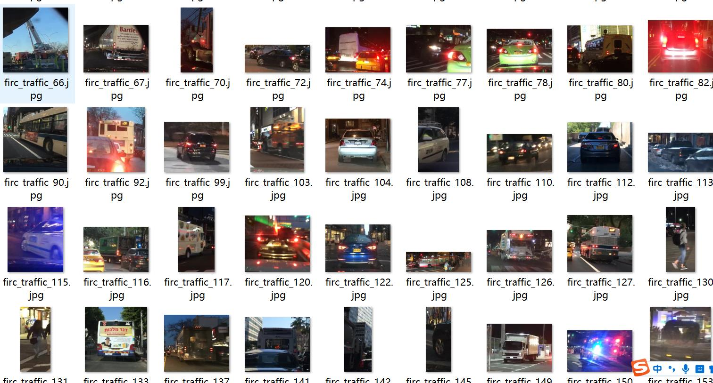
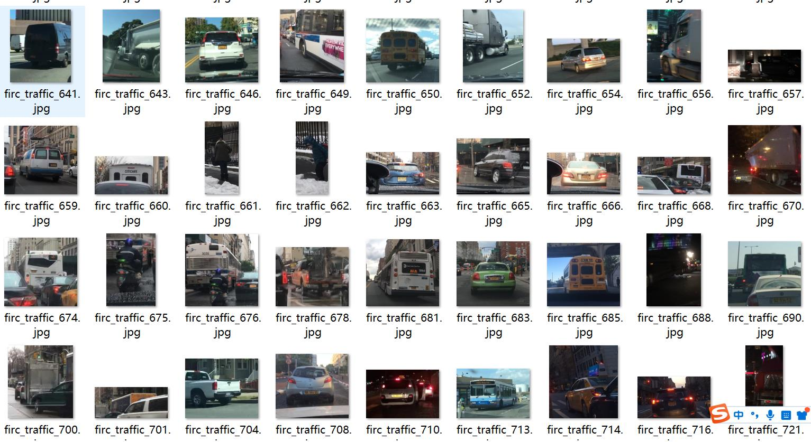
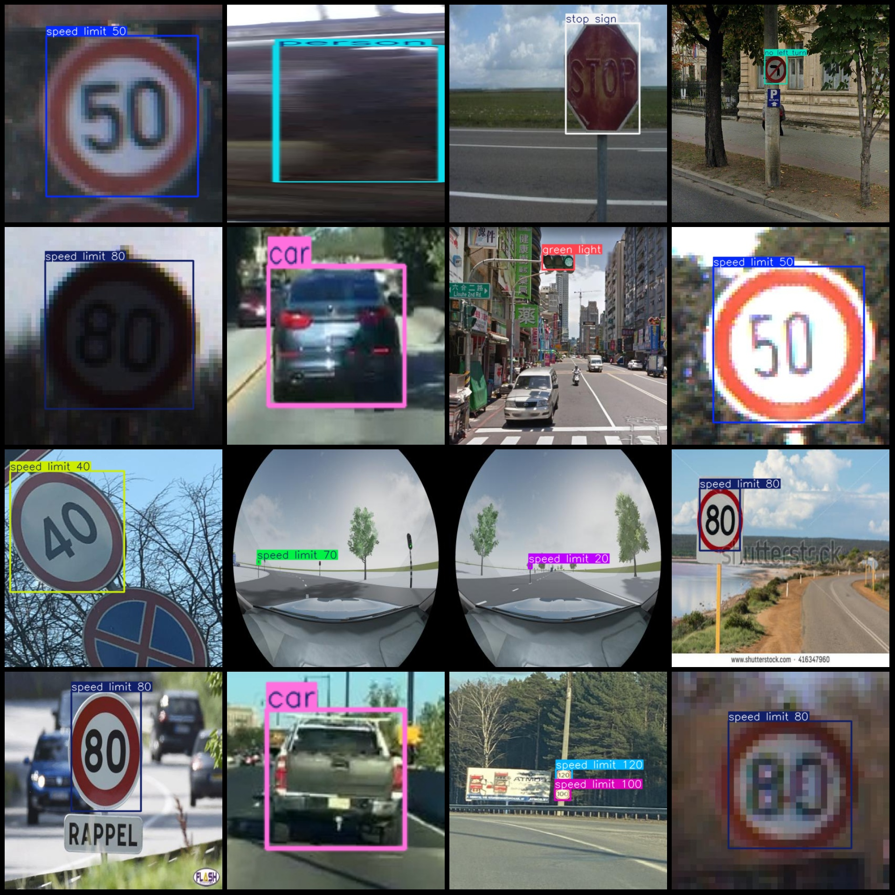
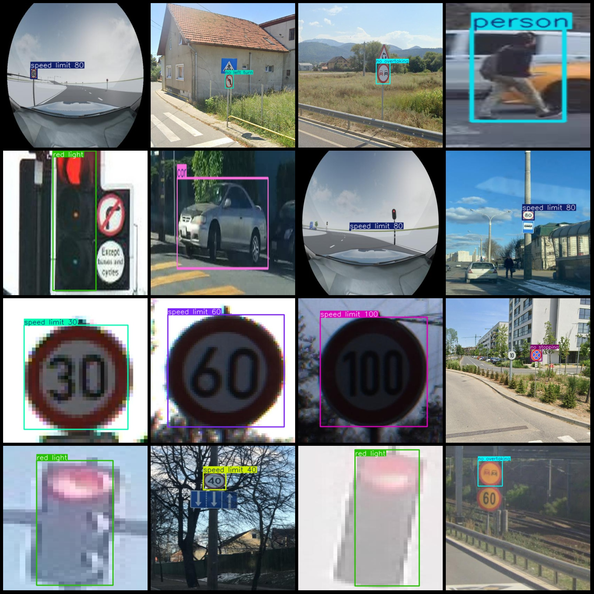

# Traffic Violation Object Detection Dataset with VOC+YOLO Format and 6697 23-Classification

Dataset format: Pascal VOC format + YOLO format (txt files without split paths, only containing jpg images and corresponding VOC format xml files and yolo format txt files)
Number of images (jpg file count): 6697
Number of annotations (xml file count): 6697
Number of annotations (txt file count): 6697
Number of annotation categories: 23
Annotation category names (note that the order in the yolo format does not correspond to this, but is based on the classes.txt in the labels folder): ["bus", "car", "green light", "motorcycle", "no entry", "no left turn", "no overtaking", "no right turn", "no stopping", "no u-turn", "person", "red light"]
"speed limit 20","speed limit 30","speed limit 40","speed limit 50","speed limit 60","speed limit 70","speed limit 80","speed limit 100","speed limit 120","stop sign","truck"]  
boxes per class:   
Bus box count = 295, images = 295
Car box count = 372, images = 372
Green light box count = 490, images = 349
Motorcycle box count = 86, images = 86
No entry box count = 229, images = 223
No left turn box count = 183, images = 181
No overtaking box count = 209, images = 201
No right turn box count = 179, images = 178
No stopping box count = 333, images = 306
No U-turn box count = 65, images = 63
Person box count = 181, images = 181
Red light box count = 475, images = 337
Speed limit 20 box count = 387, images = 380
Speed limit 30 box count = 434, images = 428
Speed limit 40 box count = 343, images = 333
Speed limit 50 box count = 404, images = 381
Speed limit 60 box count = 421, images = 421
Speed limit 70 box count = 431, images = 425
Speed limit 80 box count = 417, images = 412
Speed limit 100 box count = 365, images = 360
Speed limit 120 box count = 356, images = 342
Stop sign box count = 415, images = 415
Truck box count = 367, images = 367
total boxes: 7437  
Image resolution: Multi-resolution image, such as 640x640, 416x416, etc.
Using annotation tool: labelImg
Annotation rules: Draw a rectangle box around the class for labeling.
Important notes: The dataset does not have a division of training, validation, and test sets; you need to divide them yourself.
Special statement: This dataset does not guarantee any accuracy in the trained model or weight files.
Image preview:
## Images

Here is a pay link on Stripe ( https://buy.stripe.com/3cs8yP7sY87d0vu9AB ). Please contact me lonlonago@foxmail.com after funding $89, and I will send you a complete data files , thank you!

